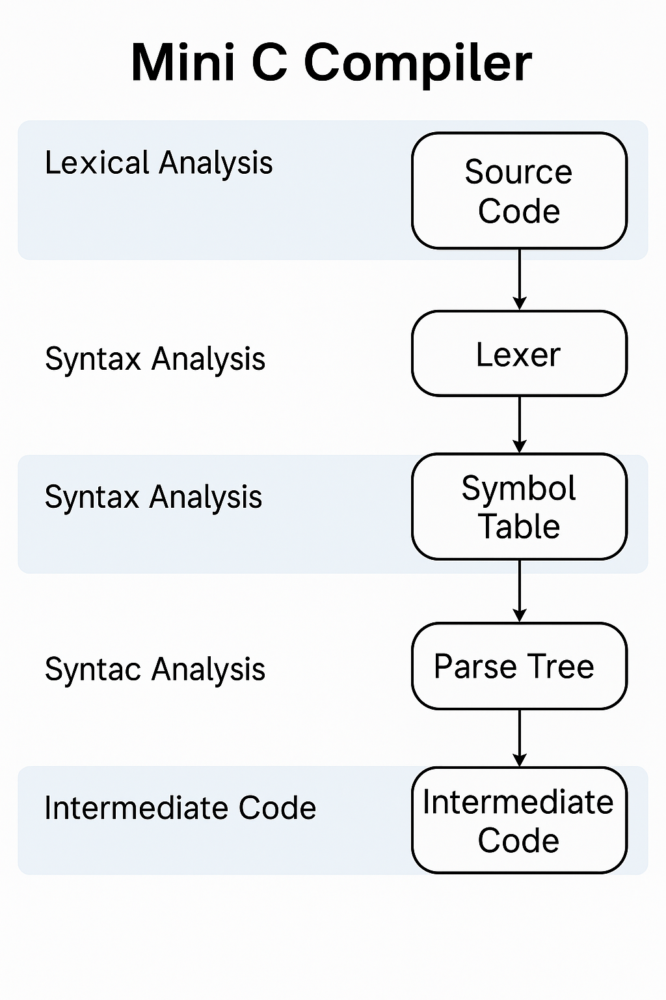

# Mini C Compiler

  

## Overview

This project implements a basic version of a **Mini C Compiler** that focuses on three key phases of compilation:

1. **Lexical Analysis**
2. **Syntax Analysis**
3. **Intermediate Code Generation**

The goal is to simulate the core functionality of a compiler for a subset of the C programming language, enabling users to understand the principles behind compilation and how source code is processed step by step.

## Features

### Lexical Analysis
- Tokenizes the input C code into identifiers, keywords, literals, operators, and delimiters.
- Recognizes valid tokens and flags lexical errors.
- Generates a symbol table for identifiers.

### Syntax Analysis
- Parses tokenized input using grammar rules.
- Constructs a parse tree to validate syntax correctness.
- Handles basic C constructs such as variable declarations, expressions, conditional statements, and loops.

### Intermediate Code Generation
- Generates Three-Address Code (TAC) for valid input programs.
- Supports arithmetic expressions, assignment statements, and simple control flow (if-else, while).
- Serves as a bridge for later stages like optimization and code generation (not included here).

## Supported Language Subset

- Data Types: `int`, `float`, `char`
- Operators: `+`, `-`, `*`, `/`, `=`, relational operators
- Control Structures: `if`, `else`, `while`
- I/O: Basic support for `printf`, `scanf` (if needed)

